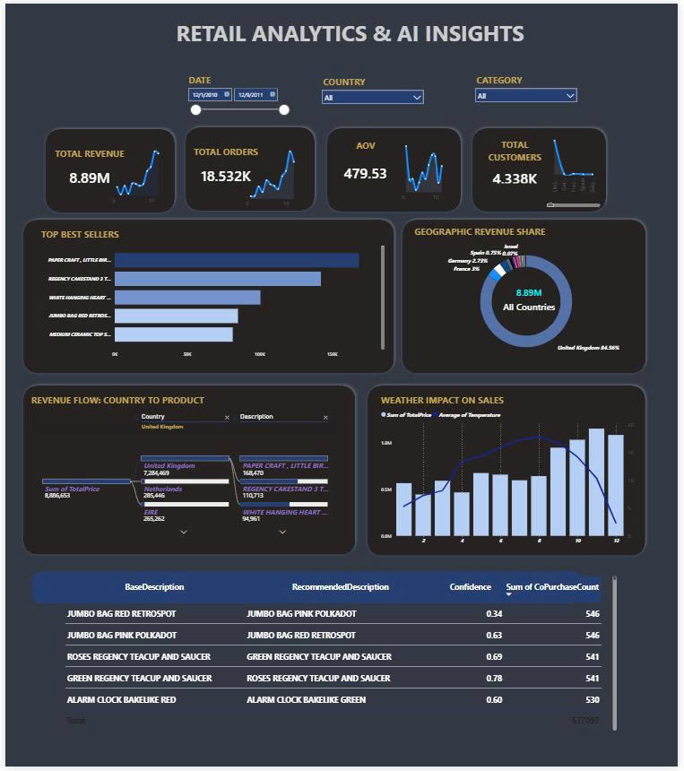

# Retail Analytics Lambda Lakehouse

An end-to-end Big Data pipeline for UK retail transaction analytics using **Apache Kafka**, **Apache Spark**, **Hadoop HDFS**, **MySQL**, and **Power BI**.

This project combines **Lambda Architecture** and a **Lakehouse-style Medallion Architecture** to support both batch analytics and near real-time data processing.

---

## Project Status

**Status:** Completed / Portfolio Version

This project was developed as a Big Data final project and has been completed as a portfolio-ready project.

The core data pipeline has been implemented, including:

- Kafka-based transaction ingestion
- Spark Structured Streaming for near real-time processing
- HDFS Bronze, Silver, and Gold data layers
- PySpark batch processing
- MySQL Serving Layer
- Power BI dashboard
- Market Basket Analysis for product recommendation insights

---

## Overview

The goal of this project is to build a Big Data analytics system for the **UK Online Retail Dataset**.

The system simulates a real retail data platform where transaction data is ingested through Kafka, processed by Spark, stored in HDFS using Bronze/Silver/Gold layers, served through MySQL, and visualized in Power BI.

The high-level data flow is:

```text
Online Retail CSV
        ↓
Apache Kafka
        ↓
Spark Structured Streaming
        ↓
HDFS Bronze Layer
        ↓
Spark Batch Processing
        ↓
HDFS Silver Layer
        ↓
Spark Analytics Processing
        ↓
HDFS Gold Layer + MySQL Serving Layer
        ↓
Power BI Dashboard
```

---

## Key Features

- Built an end-to-end Big Data pipeline for retail analytics.
- Simulated real-time data ingestion using Apache Kafka.
- Processed streaming data with Spark Structured Streaming.
- Stored raw, cleaned, and analytics-ready data in Hadoop HDFS.
- Applied Medallion Architecture with Bronze, Silver, and Gold layers.
- Implemented batch processing with PySpark.
- Enriched transaction data with weather and UK holiday datasets.
- Built Gold analytics tables for revenue, products, customers, countries, weather impact, and holiday impact.
- Implemented Market Basket Analysis for product recommendation insights.
- Served processed data through MySQL.
- Built a Power BI dashboard for business insights.

---

## Architecture

This project combines two major data architecture patterns:

### Lambda Architecture

The system uses both batch and streaming processing:

| Layer | Description |
|---|---|
| Batch Layer | Processes historical data from HDFS Bronze to Silver and Gold layers |
| Speed Layer | Processes Kafka streaming data with Spark Structured Streaming |
| Serving Layer | Stores processed data in MySQL for BI and dashboard access |

### Medallion Lakehouse Architecture

Data is organized into three layers:

| Layer | Purpose |
|---|---|
| Bronze | Stores raw or near-raw data from Kafka and supporting datasets |
| Silver | Stores cleaned, standardized, and enriched transaction data |
| Gold | Stores business-ready analytics tables for reporting and insights |

---

## Tech Stack

| Category | Technologies |
|---|---|
| Data Ingestion | Apache Kafka |
| Stream Processing | Spark Structured Streaming |
| Batch Processing | Apache Spark, PySpark |
| Distributed Storage | Hadoop HDFS |
| Resource Management | YARN |
| Serving Layer | MySQL |
| Visualization | Power BI |
| Environment | Docker, Docker Compose |
| Development | Jupyter Notebook |

---

## Repository Structure

```text
.
├── docker-compose.yml
├── .gitignore
├── notebooks/
│   ├── Create_enrichDataset.ipynb
│   ├── 01_Kafka_Producer.ipynb
│   ├── 02_spark_streaming.ipynb
│   ├── 03_bronze_to_silver.ipynb
│   └── 04_silver_to_gold.ipynb
└── powerbi/
    └── retail_analytics_dashboard.pbix
```

---

## Main Notebooks

### `Create_enrichDataset.ipynb`

Prepares supporting datasets such as weather and UK holidays, then writes them to HDFS Bronze Layer.

Main tasks:

- Load weather and holiday datasets.
- Clean and standardize date keys.
- Write supporting datasets to HDFS in Parquet format.

Output examples:

```text
hdfs://namenode:9000/data/bronze/weather_optimized
hdfs://namenode:9000/data/bronze/holidays_optimized
```

---

### `01_Kafka_Producer.ipynb`

Simulates real-time retail transaction ingestion.

Main tasks:

- Read `OnlineRetail.csv`.
- Convert each transaction into JSON format.
- Send records to Kafka topic `retail_transactions`.
- Simulate event streaming by sending records in chunks.

Kafka topic:

```text
retail_transactions
```

---

### `02_spark_streaming.ipynb`

Implements the Speed Layer using Spark Structured Streaming.

Main tasks:

- Read transaction data from Kafka.
- Parse JSON messages into structured records.
- Clean invalid transactions.
- Enrich data with weather and holiday information.
- Write raw data to HDFS Bronze Layer.
- Build Star Schema tables.
- Write dimension and fact tables to MySQL.
- Prevent duplicate writes using anti-join logic and transaction IDs.

Main MySQL tables:

```text
dim_customer
dim_product
dim_date
dim_weather
fact_sales
```

---

### `03_bronze_to_silver.ipynb`

Implements batch processing from Bronze Layer to Silver Layer.

Main tasks:

- Read raw transaction data from HDFS Bronze Layer.
- Perform data quality checks.
- Remove invalid transactions.
- Standardize data types.
- Parse invoice dates.
- Create time-based features.
- Calculate `TotalPrice`.
- Remove duplicate records.
- Enrich transactions with weather and holiday data.
- Write cleaned data to HDFS Silver Layer.

Output:

```text
hdfs://namenode:9000/data/silver/retail/transactions_cleaned
```

---

### `04_silver_to_gold.ipynb`

Implements analytics processing from Silver Layer to Gold Layer.

Main tasks:

- Read cleaned data from HDFS Silver Layer.
- Create business-ready analytics tables.
- Write Gold tables to both HDFS and MySQL.
- Generate product recommendation insights using Market Basket Analysis.

Gold tables:

```text
gold_sales_by_date
gold_sales_by_month
gold_sales_by_hour
gold_top_products
gold_top_customers
gold_sales_by_country
gold_holiday_impact
gold_weather_impact
gold_product_recommendations
```

---

## Dataset

This project uses the **Online Retail Dataset**, which contains transactions from a UK-based online retail company.

Main columns:

| Column | Description |
|---|---|
| InvoiceNo | Invoice number |
| StockCode | Product code |
| Description | Product description |
| Quantity | Quantity purchased |
| InvoiceDate | Transaction date and time |
| UnitPrice | Product unit price |
| CustomerID | Customer identifier |
| Country | Customer country |

The project also uses supporting datasets:

- Weather data
- UK holiday data

Due to file size and repository cleanliness, raw data files are not included in this repository.

Expected local data files:

```text
data/OnlineRetail.csv
data/weather_optimized.csv
data/holidays_optimized.csv
```

---

## How to Run

### 1. Clone the repository

```bash
git clone https://github.com/your-username/retail-analytics-lambda-lakehouse.git
cd retail-analytics-lambda-lakehouse
```

Replace `your-username` with your actual GitHub username.

---

### 2. Prepare data files

Create a `data` folder and place the required datasets inside it:

```text
data/
├── OnlineRetail.csv
├── weather_optimized.csv
└── holidays_optimized.csv
```

---

### 3. Start Docker services

```bash
docker compose up -d
```

This will start the main services:

- Hadoop HDFS
- YARN
- Kafka
- Zookeeper
- MySQL
- Spark Jupyter Notebook

---

### 4. Open service UIs

| Service | URL |
|---|---|
| Jupyter Notebook | http://localhost:8888 |
| HDFS NameNode UI | http://localhost:9870 |
| YARN ResourceManager UI | http://localhost:8088 |
| MySQL | localhost:3306 |

---

### 5. Run notebooks

Recommended execution order:

```text
1. Create_enrichDataset.ipynb
2. 02_spark_streaming.ipynb
3. 01_Kafka_Producer.ipynb
4. 03_bronze_to_silver.ipynb
5. 04_silver_to_gold.ipynb
```

Important note:

`02_spark_streaming.ipynb` should be started before `01_Kafka_Producer.ipynb`, because the Spark Streaming job needs to listen to Kafka messages before the producer sends transaction data.

---

## Power BI Dashboard

The Power BI dashboard is available in:

```text
powerbi/retail_analytics_dashboard.pbix
```

The dashboard connects to MySQL Serving Layer and visualizes the processed Gold tables.

Dashboard analysis includes:

- Total revenue
- Total orders
- Average order value
- Total customers
- Top-selling products
- Revenue by country
- Revenue by time
- Weather impact on sales
- Holiday impact on sales
- Product recommendation insights



---

## Business Insights

The project generates several business insights from retail transaction data:

- Identifies top-selling and high-revenue products.
- Analyzes revenue distribution by country.
- Detects seasonal and time-based sales patterns.
- Measures the impact of weather and holidays on sales.
- Finds frequently purchased product pairs using Market Basket Analysis.
- Supports cross-selling and product bundling strategies.

Example recommendation use case:

```text
If customers frequently buy Product A and Product B together,
the business can recommend Product B when a customer views or buys Product A.
```

---

## Data Pipeline Outputs

### Bronze Layer

Stores raw or near-raw data.

Example path:

```text
/data/bronze/retail/transactions
```

---

### Silver Layer

Stores cleaned and enriched data.

Example path:

```text
/data/silver/retail/transactions_cleaned
```

---

### Gold Layer

Stores business-ready analytics tables.

Example paths:

```text
/data/gold/retail/sales_by_date
/data/gold/retail/sales_by_month
/data/gold/retail/top_products
/data/gold/retail/product_recommendations
```

---

### MySQL Serving Layer

Stores processed tables for BI tools.

Example tables:

```text
fact_sales
dim_customer
dim_product
dim_date
dim_weather
gold_sales_by_date
gold_top_products
gold_product_recommendations
```

---

## Current Limitations

- The system is currently deployed in a local Docker environment, not a production cloud environment.
- The dataset is static and Kafka is used to simulate real-time streaming.
- Power BI dashboard refresh is not fully real-time in the current version.
- Market Basket Analysis is implemented using basic association logic, not advanced machine learning models.
- Delta Lake or Apache Iceberg is not yet integrated for storage-level ACID transactions.

---

## Future Improvements

- Migrate storage from HDFS to Amazon S3 or Azure Data Lake.
- Deploy Spark jobs on AWS EMR, Databricks, or Kubernetes.
- Replace raw Parquet storage with Delta Lake.
- Add schema evolution and time travel support.
- Build a real-time recommendation API.
- Integrate MLflow for model lifecycle management.
- Add CI/CD pipeline for automated deployment.
- Add natural language querying using LLMs for business users.

---

## Portfolio Highlights

This project demonstrates practical experience in:

- Big Data pipeline design
- Data Engineering
- Stream processing
- Batch processing
- Lakehouse architecture
- Distributed storage
- ETL/ELT pipeline development
- Business Intelligence
- Data visualization
- Retail analytics
- Recommendation logic


## Author

This project was developed as a Big Data final project and portfolio project.
